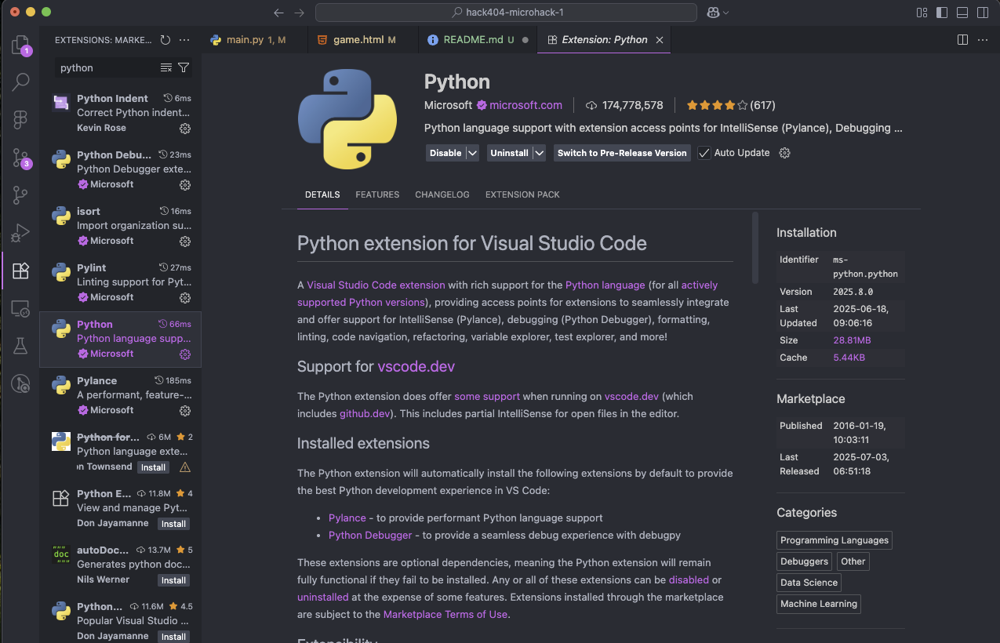

# Gurt Clicker

## Installation Requirements

Please install:
- VSCode
- Python (latest version is 3.9+)
- Postman (OPTIONAL but helpful)

Once you have VSCode installed please install the Python extension

## Next Steps

Here is how you can take your microhack to the NEXT LEVEL!

### Code Organization
- Split styles and script into their own files
  - styles.css
  - script.js

### UI/UX Improvements
- Style the webpage! Add animations!
- Add click animations (shake, bounce, particles)
- Add sound effects for clicks
- Improve responsive design for mobile
- Add a background image or gradient
- Style the counter with better fonts and colors

### Game Features
- Add upgrades/power-ups (auto-clickers, multipliers)
- Implement achievements system
- Add prestige/reset mechanics
- Save progress to localStorage or database
- Add leaderboards
- Implement different Gurt variants to unlock
- Add click combos or streak bonuses

### Backend Enhancements
- Add user authentication/sessions
- Implement database persistence (SQLite or PostgreSQL)
- Create save/load game state endpoints
- Add multiplayer features
- Implement real-time updates with WebSockets

### Advanced Features
- Add a shop system for purchasing upgrades
- Implement idle/offline progress
- Add mini-games or challenges
- Create statistics tracking (clicks per second, total time played)
- Add export/import save data functionality
- Implement themes or skins

### Technical Improvements
- Add error handling and retry logic
- Implement proper logging
- Set up deployment (Heroku, Railway, etc.)
- Add environment configuration